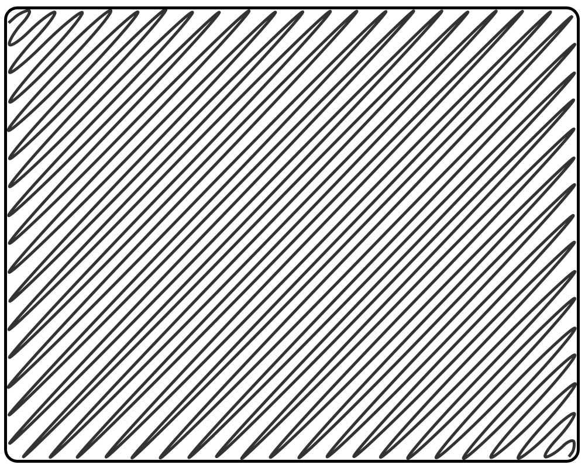
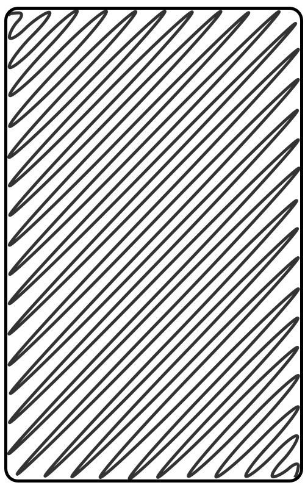

footer: ![] this is the footer text
slidenumbers: true
autoscale: true
theme: Plain Jane, 1

# [fit] mdslides test case

# Some Headline

#### This could be an impactful slogan.
#### <https://github.com/bboc/mdtools>

---

## What is this?

This is the content of index.md in the introduction.

---

## Introduction Section A

This is part of the introduction.

---

## Text

This is the content of the index file for the chapter "Text".

---

## Glossary

What follows is a definition from the glossary:

_A **glossary** is collection of explanations for words the reader might not be familiar with._

And now a glossary entry:

A collection of explanations for words the reader might not be familiar with.

And an overlay for the term [glossary](glossary:glossary) in this sentence.

---

## Section Links

Here is a section link: _Glossary Entries_

It should be possible to link to several sections in the same line, e.g. to _Background Images_ and _Glossary Entries_

Also we should be able to have a [glossary](glossary:glossary) and a section link to _Glossary Entries_ and another overlay for [term](glossary:term).

---

## Slide Breaks

This is some text on the first slide.

---

## Slide Breaks (…)

This is some text on the second slide. The text is below a headline with a continuation marker.

---

## Background Images

This slide contains a background image, and this text should be rendered on top of that image.

---

## Background Images (…)

This second slide should also contain a background image.

---

## Right-Aligned Images

This image should be aligned to the right.

---

# Glossary 

**Glossary:** A collection of explanations for words the reader might not be familiar with.

---

# Glossary (…)

**Term:** An entry in the glossary.

---

## Appendix A

Some text that appears here.

---

